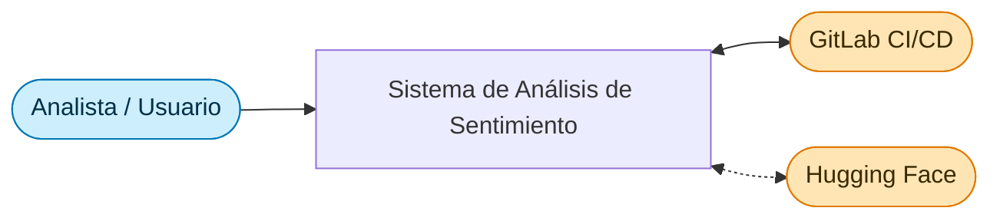

# 1. Diagrama de actores

Identifica las entidades (humanas y externas) que interactúan con el sistema.

- **Analista / Usuario**: actor humano principal, usa la interfaz web.
- **GitLab CI/CD**: sistema externo que ejecuta el pipeline de entrenamiento de los
  modelos clásicos y devuelve los artefactos.
- **Hugging Face**: fuente externa de datasets y modelos preentrenados (usada en el
  notebook de entrenamiento de DistilBERT).

