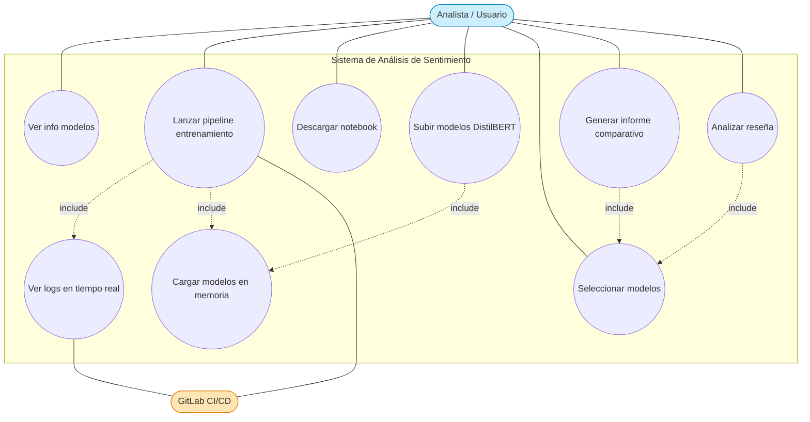

# 2. Diagrama de casos de uso

Representa las funcionalidades del sistema y los actores que las inician.

```mermaid
flowchart TB
    U([Analista / Usuario]):::a
    G([GitLab CI/CD]):::e
    subgraph S[Sistema de Análisis de Sentimiento]
        UC1((Ver info modelos))
        UC2((Lanzar pipeline entrenamiento))
        UC3((Ver logs en tiempo real))
        UC4((Descargar notebook))
        UC5((Subir modelos DistilBERT))
        UC6((Seleccionar modelos))
        UC7((Generar informe comparativo))
        UC8((Analizar reseña))
        UC9((Cargar modelos en memoria))
    end
    U --- UC1 & UC2 & UC4 & UC5 & UC6 & UC7 & UC8
    UC2 -.include.-> UC3
    UC2 -.include.-> UC9
    UC5 -.include.-> UC9
    UC7 -.include.-> UC6
    UC8 -.include.-> UC6
    UC2 --- G
    UC3 --- G
    classDef a fill:#cdeffd,stroke:#0077b6;
    classDef e fill:#ffe5b4,stroke:#e07a00;
```

> Para notación UML formal (elipses), usa el archivo `02_casos_uso.puml`.
