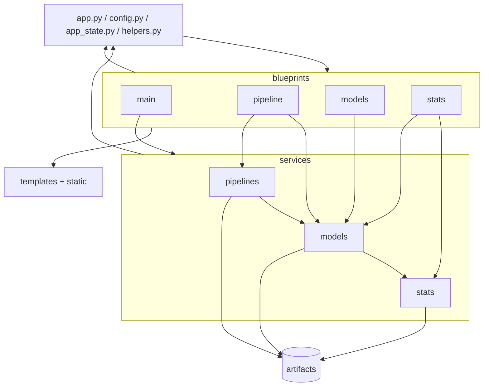

# 3. Diagrama de paquetes

Organización modular del código y dependencias entre paquetes Python.

```mermaid
flowchart TD
    APP["app.py / config.py / app_state.py / helpers.py"]

    subgraph BP[blueprints]
        BMain[main]
        BPipe[pipeline]
        BModels[models]
        BStats[stats]
    end

    subgraph SV[services]
        SModels[models]
        SPipe[pipelines]
        SStats[stats]
    end

    TPL[templates + static]
    ART[(artifacts)]

    APP --> BP
    BP --> TPL
    BMain --> SV
    BPipe --> SModels
    BPipe --> SPipe
    BModels --> SModels
    BStats --> SStats
    BStats --> SModels
    SPipe --> SModels
    SModels --> SStats
    SModels --> ART
    SPipe --> ART
    SStats --> ART
    BP --> APP
    SV --> APP
```
