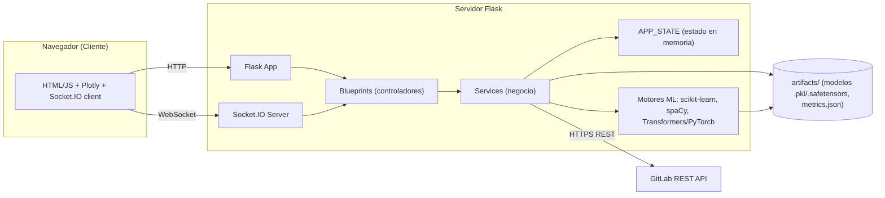

# 4. Diagrama de componentes

Componentes ejecutables e interfaces (HTTP, WebSocket, API REST externa).

```mermaid
flowchart LR
    subgraph Cliente["Navegador (Cliente)"]
        UI["HTML/JS + Plotly + Socket.IO client"]
    end

    subgraph Servidor["Servidor Flask"]
        FL["Flask App"]
        SIO["Socket.IO Server"]
        BPc["Blueprints (controladores)"]
        SVc["Services (negocio)"]
        STATE["APP_STATE (estado en memoria)"]
        ML["Motores ML: scikit-learn, spaCy, Transformers/PyTorch"]
    end

    GIT["GitLab REST API"]
    FS[("artifacts/ (modelos .pkl/.safetensors, metrics.json)")]

    UI -- HTTP --> FL
    UI -- WebSocket --> SIO
    FL --> BPc
    SIO --> BPc
    BPc --> SVc
    SVc --> STATE
    SVc --> ML
    SVc -- HTTPS REST --> GIT
    SVc --> FS
    ML --> FS
```
