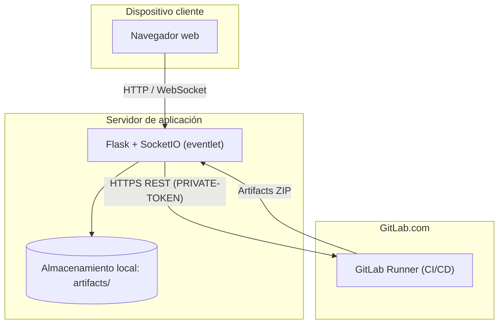

# 6. Diagrama de despliegue

Nodos físicos/lógicos y protocolos de comunicación.

```mermaid
flowchart TB
    subgraph Cliente["Dispositivo cliente"]
        Nav["Navegador web"]
    end
    subgraph Host["Servidor de aplicación"]
        Flask["Flask + SocketIO (eventlet)"]
        Artifacts[("Almacenamiento local: artifacts/")]
    end
    subgraph Cloud["GitLab.com"]
        Runner["GitLab Runner (CI/CD)"]
    end
    Nav -- "HTTP / WebSocket" --> Flask
    Flask -- "HTTPS REST (PRIVATE-TOKEN)" --> Runner
    Runner -- "Artifacts ZIP" --> Flask
    Flask --> Artifacts
```
