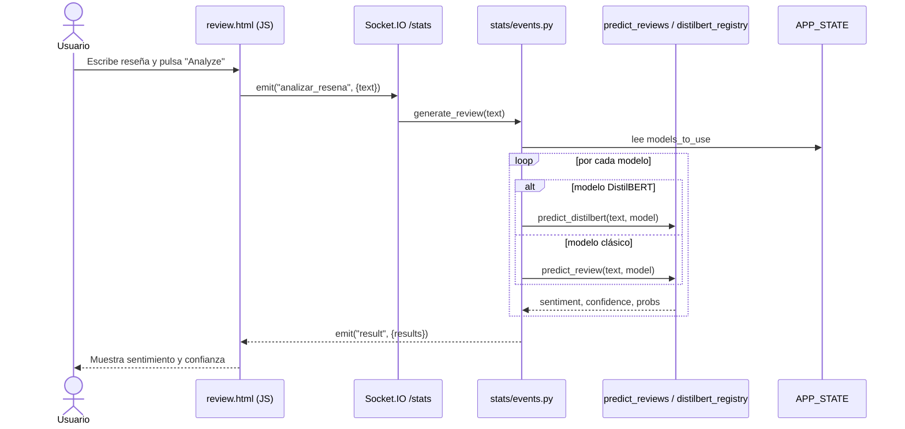
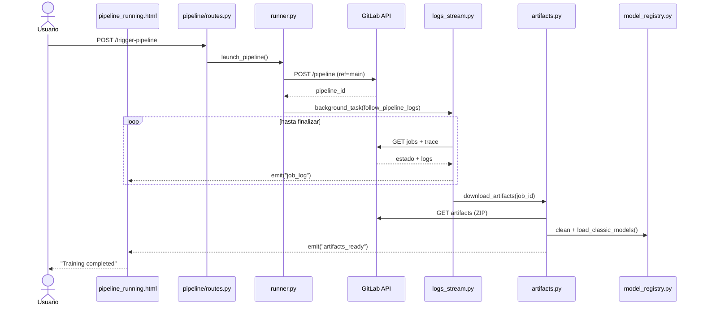
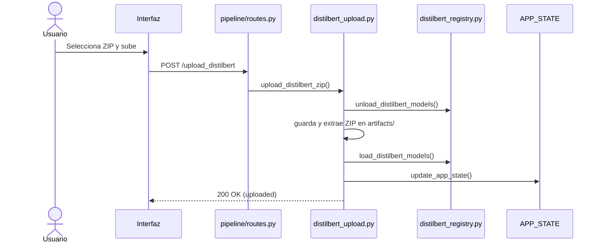

# 7. Diagramas de secuencia

## 7a. Analizar una reseña

```mermaid
sequenceDiagram
    actor U as Usuario
    participant V as review.html (JS)
    participant S as Socket.IO /stats
    participant E as stats/events.py
    participant R as predict_reviews / distilbert_registry
    participant ST as APP_STATE

    U->>V: Escribe reseña y pulsa "Analyze"
    V->>S: emit("analizar_resena", {text})
    S->>E: generate_review(text)
    E->>ST: lee models_to_use
    loop por cada modelo
        alt modelo DistilBERT
            E->>R: predict_distilbert(text, model)
        else modelo clásico
            E->>R: predict_review(text, model)
        end
        R-->>E: sentiment, confidence, probs
    end
    E-->>V: emit("result", {results})
    V-->>U: Muestra sentimiento y confianza
```

## 7b. Lanzar pipeline de entrenamiento (modelos clásicos)

```mermaid
sequenceDiagram
    actor U as Usuario
    participant V as pipeline_running.html
    participant P as pipeline/routes.py
    participant Run as runner.py
    participant G as GitLab API
    participant L as logs_stream.py
    participant A as artifacts.py
    participant Reg as model_registry.py

    U->>P: POST /trigger-pipeline
    P->>Run: launch_pipeline()
    Run->>G: POST /pipeline (ref=main)
    G-->>Run: pipeline_id
    Run->>L: background_task(follow_pipeline_logs)
    loop hasta finalizar
        L->>G: GET jobs + trace
        G-->>L: estado + logs
        L-->>V: emit("job_log")
    end
    L->>A: download_artifacts(job_id)
    A->>G: GET artifacts (ZIP)
    A->>Reg: clean + load_classic_models()
    A-->>V: emit("artifacts_ready")
    V-->>U: "Training completed"
```

## 7c. Subir modelos DistilBERT (ZIP)

```mermaid
sequenceDiagram
    actor U as Usuario
    participant V as Interfaz
    participant P as pipeline/routes.py
    participant Up as distilbert_upload.py
    participant Reg as distilbert_registry.py
    participant ST as APP_STATE

    U->>V: Selecciona ZIP y sube
    V->>P: POST /upload_distilbert
    P->>Up: upload_distilbert_zip()
    Up->>Reg: unload_distilbert_models()
    Up->>Up: guarda y extrae ZIP en artifacts/
    Up->>Reg: load_distilbert_models()
    Up->>ST: update_app_state()
    Up-->>V: 200 OK (uploaded)
```
