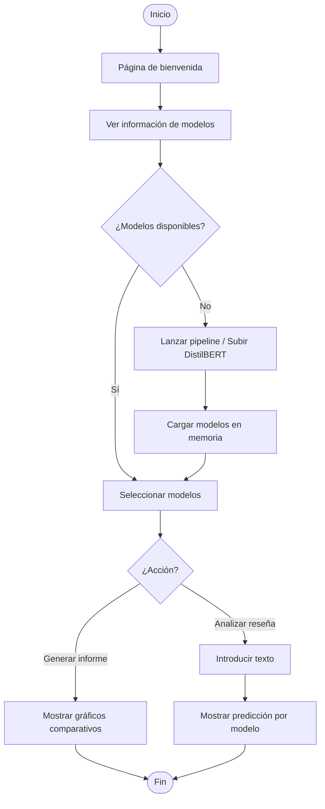

# 8. Diagrama de actividad

Flujo principal de uso de la aplicación.

```mermaid
flowchart TD
    A([Inicio]) --> B[Página de bienvenida]
    B --> C[Ver información de modelos]
    C --> D{¿Modelos disponibles?}
    D -- No --> E[Lanzar pipeline / Subir DistilBERT]
    E --> F[Cargar modelos en memoria]
    D -- Sí --> G[Seleccionar modelos]
    F --> G
    G --> H{¿Acción?}
    H -- Generar informe --> I[Mostrar gráficos comparativos]
    H -- Analizar reseña --> J[Introducir texto]
    J --> K[Mostrar predicción por modelo]
    I --> L([Fin])
    K --> L
```
