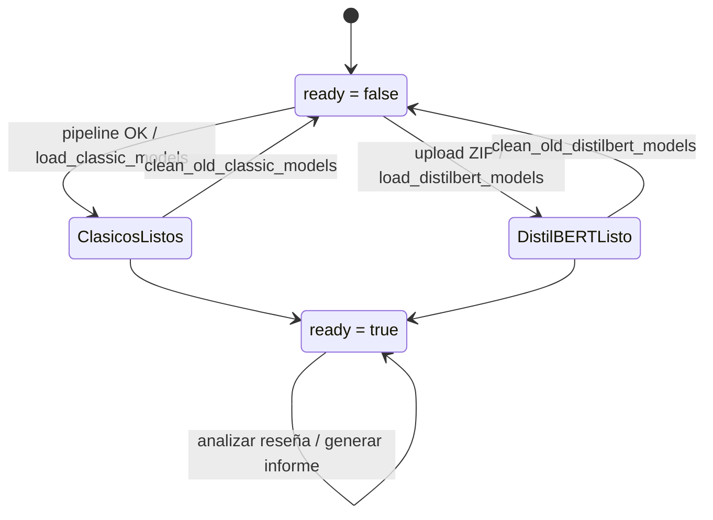

# 9. Diagrama de estados (APP_STATE)

Evolución de la disponibilidad de los modelos en el estado global de la aplicación.

```mermaid
stateDiagram-v2
    [*] --> SinModelos
    SinModelos --> ClasicosListos: pipeline OK / load_classic_models
    SinModelos --> DistilBERTListo: upload ZIP / load_distilbert_models
    ClasicosListos --> Listo
    DistilBERTListo --> Listo
    Listo --> Listo: seleccionar modelos
    Listo --> Listo: analizar reseña / generar informe
    ClasicosListos --> SinModelos: clean_old_classic_models
    DistilBERTListo --> SinModelos: clean_old_distilbert_models
    Listo: ready = true
    SinModelos: ready = false
```
